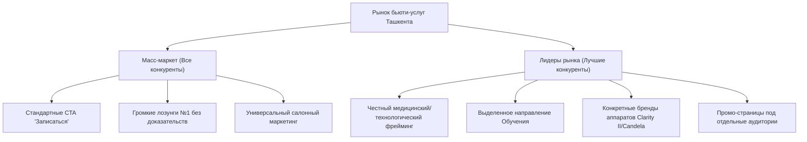

# Исследование рынка и конкурентов (Ташкент)

## 1. Обзор конкурентного поля

Анализ 10 наиболее сильных локальных конкурентов с собственными сайтами и посадочными страницами в Ташкенте по направлениям: лазерная эпиляция, ресницы/брови, перманентный макияж и обучение.

| Компания | Сайт | Основной оффер | Основной CTA | Ключевые преимущества | Элементы доверия | Фокус продвижения |
|---|---|---|---|---|---|---|
| **HAIRBOSS** | [hairboss.uz](https://hairboss.uz) | Лазерная эпиляция, «результат 100%» / «гарантия результата» | Запись / Telegram-бот | Аппараты Candela, XFEST, сеть студий, медики | 9–10 филиалов, рейтинг 5, медицинский персонал | Лазерная эпиляция |
| **LaseMe** | [laseme.uz](https://laseme.uz) | Безопасная эпиляция на Clarity II для любых волос | Запись / контакт | Аппарат Clarity II, безопасность | Медицинский фрейминг, локальность в Ташкенте | Лазерная эпиляция |
| **Inhype Beauty Zone** | [inhypebeauty.uz](https://inhype-beauty-tashkent.uz/) | Премиум-салон в центре Ташкента, полный спектр услуг | Запись по телефону | Премиум-класс, центр города, много направлений | Адреса, контакты, соцсети | Мультисервис (салон) |
| **ROYA Laser Studio** | [roya.uz](https://roya.uz) | Профессиональная лазерная эпиляция | Запись через IG / TG | Узкая специализация, сопровождение | Локация, часы работы, мессенджеры | Лазерная эпиляция |
| **EVOSTUDIO** | [evostudio.pages.dev](https://evostudio.pages.dev/) | Современное оборудование, гарантия результата | Запись / Контакт | Медицинский персонал, оборудование | Медперсонал, привязка к городу | Лазерная эпиляция |
| **Adelle** | [adelle.uz](https://adelle.uz) | Эпиляция с гарантией и 80–90% уменьшения волос | Запись / Консультация | Гарантия 80-90% эффекта, локальная студия | Четкие цифры результата | Лазерная эпиляция |
| **Miss Laser** | [misslaser.uz](https://misslaser.uz) | «Лазерная эпиляция №1 теперь в Ташкенте» | Запись через WA/TG | Сеть филиалов, отдельный блок обучения | Адреса филиалов, контакты | Лазер + обучение |
| **HairBoss Hot** | [hot.hairboss.uz](https://hot.hairboss.uz) | Горящие предложения / скидочная карта BENEFIT | Узнать предложение | Скидочные карты, сеть студий | Акционные промо-страницы | Промо-пакеты лазера |
| **Microblading.uz** | [microblading.uz](https://microblading.uz) | Перманентный макияж и микроблейдинг | Запись на консультацию | Локальная специализация на PMU | Работы, адрес, узкий профиль | Перманентный макияж |
| **Salon.uz** | [salon.uz](https://salon.uz) | Уход за бровями и ресницами | Перейти к услуге | Удобный салонный агрегатор | Локальный авторитет | Брови и ресницы |

---

## 2. Повторяющиеся паттерны на рынке

### Офферы
* «Лазерная эпиляция в Ташкенте»
* «Гарантия 100% результата / видимый эффект»
* «Современное премиум-оборудование»
* «Премиум-салон / высокий уровень»
* «Обучение бьюти-мастеров с нуля»

### Призывы к действию (CTA)
* «Записаться» / «Связаться»
* Direct-переход в Telegram / WhatsApp
* «Записаться на консультацию»

### Элементы доверия
* Отзывы и оценки 2ГИС / Yandex
* Указание адресов, филиалов и интерактивных карт
* Упоминание медицинского персонала или сертифицированного оборудования
* Ссылки на живой Instagram / Telegram с работами

---

## 3. Сравнительный анализ: Масс-маркет vs Лидеры рынка

