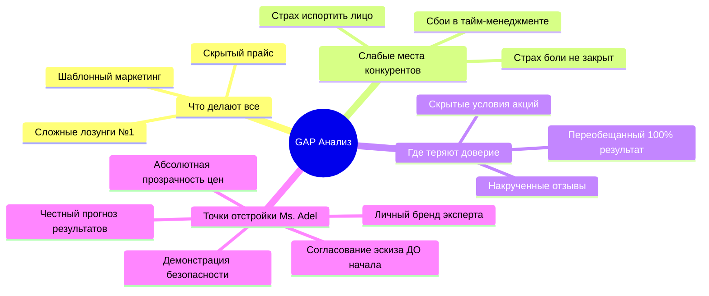
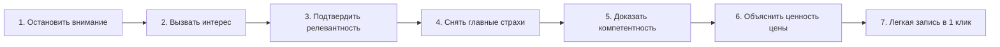

# GAP-анализ и Стратегия конверсии

## 1. GAP-анализ рынка

---

## 2. Ключевые векторы отстройки бренда Ms. Adel

1. **Честный маркетинг вместо сказок**: 
   Отказ от обещаний «100% гладкости навсегда». Открытое информирование о необходимости поддерживающих процедур.
2. **Демонстрация безопасности и комфорта**: 
   Детальное описание протокола стерильности и контроля температуры при лазере.
3. **Прозрачность цен без скрытых условий**: 
   Полный фиксированный прайс доступен пользователю ДО записи.
4. **Гарантия согласования эскиза**: 
   Предварительный эскиз формы бровей/губ/эффекта ресниц утверждается с клиентом перед началом.
5. **Сила личного бренда мастера**: 
   Продажа доверия к личному опыту мастера (10+ лет, 5000+ клиентов, обучает других), а не безымянной студии.

---

## 3. Стратегия конверсии (7 шагов воронки сайта)

1. **Остановить внимание**: За несколько секунд показать личный бренд опытного мастера с 10+ годами практики.
2. **Вызвать интерес**: Продемонстрировать 4 чётких направления работы (Ресницы, Перманент, Лазер, Обучение).
3. **Подтвердить релевантность**: Показать естественные фото работ до/после и открытый прайс.
4. **Снять главные страхи**: Объяснить, как проходит процедура, почему это не больно и как согласовывается результат.
5. **Доказать компетентность**: Подтвердить экспертность фактом авторского обучения мастеров и сертификатами.
6. **Объяснить ценность цены**: Показать, что стоимость — это плата за безопасность, предсказуемый результат и отсутствие риска переделки.
7. **Довести до заявки**: Сделать запись простым действием через привычный мессенджер Telegram.

---

## 4. 10 Главных правил стратегии

1. Показывай мастера раньше, чем список услуг.
2. Доказывай каждое заявление фактами и цифрами.
3. Исключай обещания, которые невозможно гарантировать на 100%.
4. Демонстрируй готовый результат раньше описания процесса.
5. Сохраняй полную прозрачность стоимости.
6. Снимай страх ошибки до обсуждения цен.
7. Подтверждай экспертность через факт обучения других мастеров.
8. Упрощай запись до одного клика в Telegram.
9. Фиксируй ожидания клиента до начала работы.
10. Строй доверие вокруг личности мастера, а не безымянного бренда.
