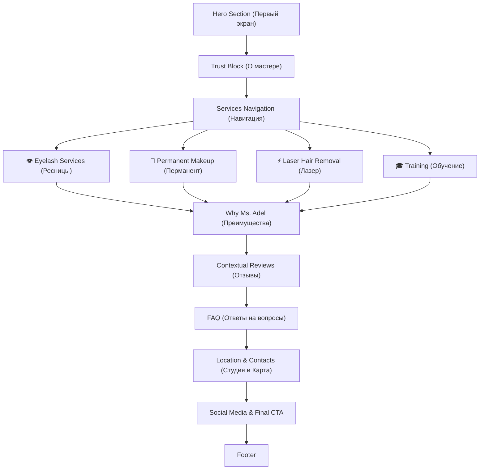

# Архитектура и структура сайта (Website Structure)

## 1. Концепция архитектуры

Вместо классического «одностраничника» используется **структура персонального бренда с якорными мини-посадочными секциями**. Пользователь сначала принимает решение доверить свою внешность мастеру, а затем переходит в интересующее направление.

---

## 2. Посекционный разбор структуры

### 1. Hero (Первый экран)
* **Цель**: За 3 секунды объяснить, кто такой Ms. Adel и какие направления доступны.
* **Закрывает возражение**: *«Я не понимаю, куда попал» / «Это салон или частный мастер?»*
* **Вывод для пользователя**: Это личный бренд мастера с 4 ключевыми услугами.
* **Элементы доверия**: Реальное фото мастера, опыт 10+ лет, 5000+ клиентов.
* **CTA**: Да (Записаться в Telegram).

### 2. Trust Block (О мастере)
* **Цель**: Создать персональное доверие к человеку до изучения прайса.
* **Закрывает возражение**: *«Почему именно этому мастеру можно доверить лицо?»*
* **Вывод для пользователя**: Огромный практический опыт, обучение других мастеров.
* **Элементы доверия**: Сертификаты, факты работы, регалии.
* **CTA**: Нет.

### 3. Services Navigation (Быстрая навигация)
* **Цель**: Мгновенный переход к нужной услуге в 1 клик.
* **Закрывает возражение**: *«Мне нужна только одна конкретная процедура, не хочу читать всё».*
* **CTA**: Якорные ссылки.

### 4. Eyelash Services (Секция «Ресницы»)
* **Цель**: Раскрыть ламинирование, корейскую технику и наращивание ресниц.
* **Закрывает возражение**: *«Боюсь неестественных 'щёток' на глазах».*
* **Элементы доверия**: Фото работ без фильтров, открытая цена от 100 000 сум.
* **CTA**: Записаться на ресницы.

### 5. Permanent Makeup (Секция «Перманентный макияж»)
* **Цель**: Презентовать пудровое напыление, акварельные губы и растушёвку.
* **Закрывает возражение**: *«Боюсь испортить форму или ухода цвета в синеву».*
* **Элементы доверия**: Пример заживших работ, описание этапа эскиза.
* **CTA**: Записаться на перманент.

### 6. Laser Hair Removal (Секция «Лазерная эпиляция»)
* **Цель**: Презентовать лазерную эпиляцию по зонам.
* **Закрывает возражение**: *«Будет больно или останутся ожоги».*
* **Элементы доверия**: Понятный прайс по зонам, объяснение курса.
* **CTA**: Записаться на лазер.

### 7. Training (Секция «Обучение бьюти-мастеров»)
* **Цель**: Продать обущающие программы (Ламинация, Наращивание, Комбо).
* **Закрывает возражение**: *«Предоставят ли материалы и моделей для практики?»*
* **Элементы доверия**: Предоставление 100% материалов и моделей, опыт преподавания.
* **CTA**: Записаться на обучение.

### 8. Why Clients Choose Ms. Adel (Преимущества)
* **Цель**: Сформулировать сквозные ценности мастера.
* **Элементы доверия**: Отсутствие скрытых доплат, фиксированный эскиз, 10+ лет опыта.

### 9. Reviews & Social Proof (Отзывы)
* **Цель**: Закрепить доверие социальными доказательствами.
* **Рекомендация**: Распределять контекстные отзывы внутри соответствующей секции услуги!

### 10. FAQ (Ответы на частые вопросы)
* **Цель**: Снять последние барьеры перед записью.

### 11. Location & Contacts (Локация студии)
* **Цель**: Подтвердить физическое существование студии в Сергели.
* **Элементы доверия**: Карта Яндекс/Google, ориентир Jiz-Biz, фото студии The Glow Up.

### 12. Social Media & Footer
* **Цель**: Дополнительные точки контакта (Instagram, Telegram).
