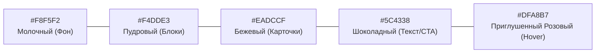

# Дизайн-система и Визуальные гайдлайны (Soft Premium)

## 1. Философия дизайна

**Философия стиля**: **Soft Premium** (Мягкий премиальный минимализм).

Не роскошный пафосный салон с черным мрамором и золотом. Не детско-девочковый сайт с бабочками и блестками. Это спокойное, эстетичное пространство, транслирующее чистоту, заботу и профессионализм.

```
Главная эмоция: "Здесь спокойно, красиво, профессионально. Этому мастеру можно доверить лицо."
```

---

## 2. Цветовая палитра (Color Tokens)



| Токен | HEX-код | Назначение |
|---|---|---|
| **Primary Background** | `#F8F5F2` | Молочный мягкий фон (вместо стерильного белого) |
| **Secondary Background**| `#F4DDE3` | Пудрово-розовый (акцентные крупные блоки) |
| **Surface / Card** | `#EADCCF` | Теплый бежевый (карточки и плашки) |
| **Text & Primary CTA** | `#5C4338` | Глубокий шоколадный (основной текст и кнопки вместо черного) |
| **Accent / Hover** | `#DFA8B7` | Приглушенный розовый (интерактивные состояния, бейджи) |

---

## 3. Типографика (Typography)

* **Рекомендуемые гарнитуры**: `Manrope`, `Inter`, `Plus Jakarta Sans` (Google Fonts).
* **Размеры на Desktop**:
  * **H1**: `48px – 72px` (Bold / SemiBold)
  * **H2**: `32px – 40px` (SemiBold)
  * **H3**: `24px – 28px` (Medium)
  * **Body text**: `18px – 20px` (Regular, `line-height: 1.6`)
* **Отступы между секциями**: `100px – 140px` (очень много воздуха).

---

## 4. Спецификация UI-компонентов

### 🔘 Кнопки (CTA Buttons)
* **Высота**: `56px – 60px`.
* **Скруглённость**: `16px – 20px` (`border-radius`).
* **Цвет**: Заливка `#5C4338`, текст `#F8F5F2`.
* **Запрещено**: Градиенты, неоновое свечение, рамки с золотом.

### 🃏 Карточки (Cards)
* **Фон**: `#EADCCF` или `#FFFFFF`.
* **Скруглённость**: `24px – 28px`.
* **Тени**: Невесомая размытая тень (`box-shadow: 0 10px 30px rgba(92, 67, 56, 0.05)`).

---

## 5. Требования к фотографиям и визуалу

* **РАЗРЕШЕНО**: Живые фотографии мастера Адель, реальные макро-снимки работ (ресницы, брови, губы), дневной свет, естественная текстура кожи.
* **ЗАПРЕЩЕНО**: Стоковые девушки из интернета, сильная ретушь (эффект "пластикового лица"), изображения с явно видными AI-артефактами.

---

## 6. Запрещенные паттерны дизайна (Forbidden List)

❌ Черный "luxury" дизайн с золотыми вензелями  
❌ Неоновые яркие градиенты  
❌ Glassmorphism (затуманенное стекло на темном фоне)  
❌ Тяжелые 3D-модели и фоновые абстракции  
❌ Избыточные анимации и параллакс на каждом блоке  
❌ Автопрокрутка слайдеров  
❌ Детские элементы декора (сердечки, бабочки, блестки)  
