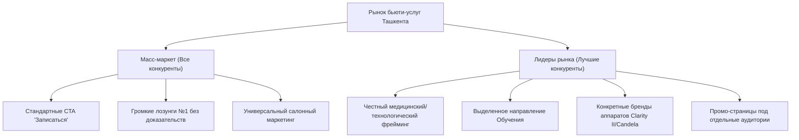
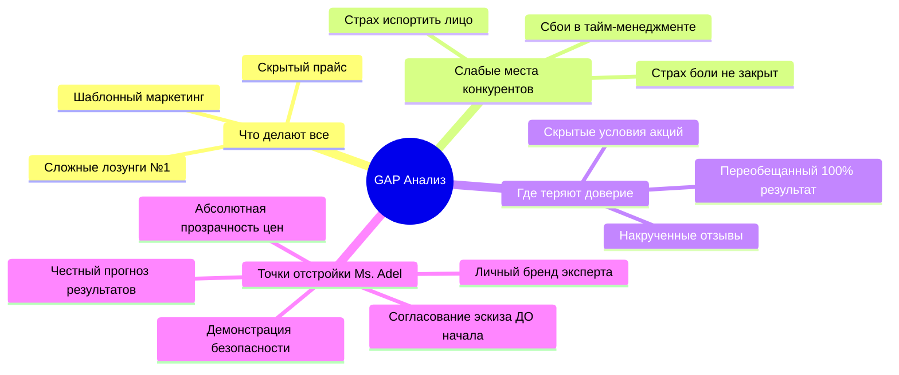
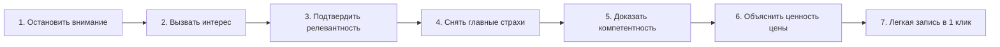
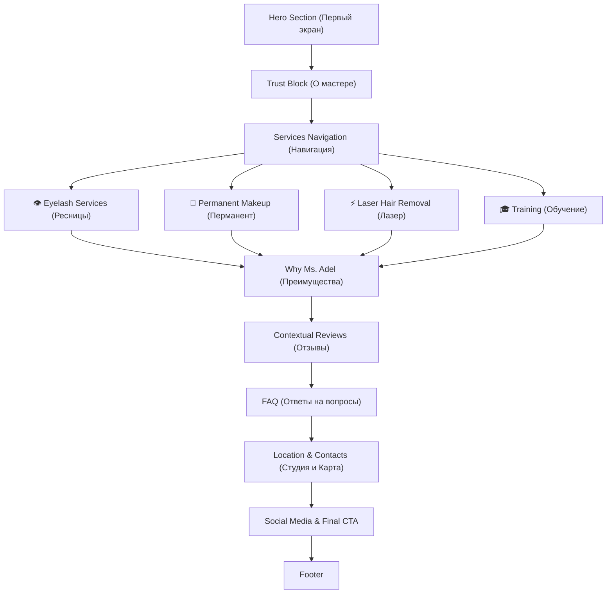
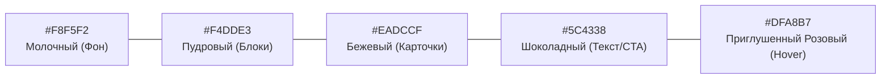

# MASTER DOCUMENT — Ms. Adel (Beauty & Education)

> Единый сводный документ проекта. Содержит информацию о бизнесе, исследование рынка, анализ аудитории, стратегию отстройки, структуру сайта, готовый копирайтинг и дизайн-систему.

---

## 📑 Оглавление

1. [1. Информация о бизнесе](#1-информация-о-бизнесе)
2. [2. Исследование рынка и конкурентов (Ташкент)](#2-исследование-рынка-и-конкурентов-ташкент)
3. [3. Анализ аудитории, болей и отзывов клиентов](#3-анализ-аудитории-болей-и-отзывов-клиентов)
4. [4. GAP-анализ и Стратегия конверсии](#4-gap-анализ-и-стратегия-конверсии)
5. [5. Архитектура и структура сайта](#5-архитектура-и-структура-сайта)
6. [6. Готовый копирайтинг сайта](#6-готовый-копирайтинг-сайта)
7. [7. Дизайн-система и Визуальные гайдлайны (Soft Premium)](#7-дизайн-система-и-визуальные-гайдлайны-soft-premium)

---

# 1. Информация о бизнесе

## 1.1. Основные данные

* **Название бьюти-брендинга**: Ms. Adel
* **Ниша**: Бьюти-услуги премиального уровня и авторское обучение мастеров
* **Город**: Ташкент, Узбекистан
* **Опыт мастера**: 10+ лет практической работы
* **Клиентская база**: 5000+ довольных клиентов

### Контактные данные
* **Телефон**: [+998 90 924 44 16](tel:+998909244416)
* **Telegram (Личные сообщения / Запись)**: [@MisssAdel](https://t.me/MisssAdel)
* **Telegram-канал**: [@MissAdelBeauty](https://t.me/MissAdelBeauty)
* **Instagram**: [@Lady_lash5](https://www.instagram.com/Lady_lash5)

---

## 1.2. Локация и филиал

* **Студия**: Салон красоты **The Glow Up**
* **Адрес**: Ташкент, Сергели-8, дом 21С
* **График работы**: Ежедневно с 10:00 до 20:00
* **Ориентир**: Ресторан Jiz-Biz
* **Карты**:
  * [Яндекс.Карты](https://yandex.uz/maps/-/CPsCeGjS)
  * [Google Maps](https://maps.app.goo.gl/VDGRirLiJ4STCRtZ6)

---

## 1.3. Услуги и Прайс-лист

### 👁️ Ресницы
* **Классическое наращивание**: 250 000 сум
* **Мокрый эффект**: 300 000 сум
* **Классическая ламинация**: 250 000 сум
* **Корейская ламинация**: 350 000 сум
* **Ботокс ресниц**: 100 000 сум
* *Полный прайс*: [Telegra.ph — Прайс ресницы](https://telegra.ph/Prajs-resnicy-01-17-2)

### 👄 Перманентный макияж
* **Пудровое напыление**: 800 000 сум
* **Теневая растушёвка**: 800 000 сум
* **Акварельные губки**: 800 000 сум
* **Эффект помады**: 800 000 сум
* **Коррекция**: 400 000 сум
* *Полный прайс*: [Telegra.ph — Прайс перманент](https://telegra.ph/Prajs-permanent-01-17)

### ⚡ Лазерная эпиляция
* **Верхняя губа / подбородок**: 100 000 сум
* **Подмышки**: 200 000 сум
* **Руки (половина)**: 350 000 сум
* **Ноги (половина)**: 400 000 сум
* **Бикини**: 400 000 сум
* *Полный прайс*: [Telegra.ph — Прайс лазер](https://telegra.ph/Prajs-lazer-01-17)

---

## 1.4. Обучение бьюти-мастеров

> **Особенность обучения**: Все расходные материалы для работы и модели для практики предоставляются мастером.

* **01. Ламинирование ресниц**  
  Классическая ламинация + новая корейская техника. Материалы, схемы, безопасность и отработка на моделях.
* **02. Наращивание ресниц**  
  Все базовые техники наращивания, эффекты, работа с объёмом и сервисные фишки для работы с клиентом.
* **03. Комбо-курс**  
  Полная программа из двух направлений: ламинация, корейская техника, наращивание и пошаговый стартовый разбор входа в профессию.

---

## 1.5. О мастере (Адель)

Сертифицированный мастер по наращиванию и ламинированию ресниц, перманентному макияжу и лазерной эпиляции. Главная задача — создать естественный, аккуратный и выразительный результат, подчеркивающий индивидуальную красоту клиента.

* В работе используются только премиальные материалы.
* Индивидуальный подбор формы, эффекта и оттенка под морфотип лица.
* Высочайшие стандарты безопасности, стерильности и комфорта.
* Авторская методика обучения с упором на практику и разбор сложных кейсов.

---

# 2. Исследование рынка и конкурентов (Ташкент)

## 2.1. Обзор конкурентного поля

Анализ 10 наиболее сильных локальных конкурентов с собственными сайтами и посадочными страницами в Ташкенте по направлениям: лазерная эпиляция, ресницы/брови, перманентный макияж и обучение.

| Компания | Сайт | Основной оффер | Основной CTA | Ключевые преимущества | Элементы доверия | Фокус продвижения |
|---|---|---|---|---|---|---|
| **HAIRBOSS** | [hairboss.uz](https://hairboss.uz) | Лазерная эпиляция, «результат 100%» / «гарантия результата» | Запись / Telegram-бот | Аппараты Candela, XFEST, сеть студий, медики | 9–10 филиалов, рейтинг 5, медицинский персонал | Лазерная эпиляция |
| **LaseMe** | [laseme.uz](https://laseme.uz) | Безопасная эпиляция на Clarity II для любых волос | Запись / контакт | Аппарат Clarity II, безопасность | Медицинский фрейминг, локальность в Ташкенте | Лазерная эпиляция |
| **Inhype Beauty Zone** | [inhypebeauty.uz](https://inhype-beauty-tashkent.uz/) | Премиум-салон в центре Ташкента, полный спектр услуг | Запись по телефону | Премиум-класс, центр города, много направлений | Адреса, контакты, соцсети | Мультисервис (салон) |
| **ROYA Laser Studio** | [roya.uz](https://roya.uz) | Профессиональная лазерная эпиляция | Запись через IG / TG | Узкая специализация, сопровождение | Локация, часы работы, мессенджеры | Лазерная эпиляция |
| **EVOSTUDIO** | [evostudio.pages.dev](https://evostudio.pages.dev/) | Современное оборудование, гарантия результата | Запись / Контакт | Медицинский персонал, оборудование | Медперсонал, привязка к городу | Лазерная эпиляция |
| **Adelle** | [adelle.uz](https://adelle.uz) | Эпиляция с гарантией и 80–90% уменьшения волос | Запись / Консультация | Гарантия 80-90% эффекта, локальная студия | Четкие цифры результата | Лазерная эпиляция |
| **Miss Laser** | [misslaser.uz](https://misslaser.uz) | «Лазерная эпиляция №1 теперь в Ташкенте» | Запись через WA/TG | Сеть филиалов, отдельный блок обучения | Адреса филиалов, контакты | Лазер + обучение |
| **HairBoss Hot** | [hot.hairboss.uz](https://hot.hairboss.uz) | Горящие предложения / скидочная карта BENEFIT | Узнать предложение | Скидочные карты, сеть студий | Акционные промо-страницы | Промо-пакеты лазера |
| **Microblading.uz** | [microblading.uz](https://microblading.uz) | Перманентный макияж и микроблейдинг | Запись на консультацию | Локальная специализация на PMU | Работы, адрес, узкий профиль | Перманентный макияж |
| **Salon.uz** | [salon.uz](https://salon.uz) | Уход за бровями и ресницами | Перейти к услуге | Удобный салонный агрегатор | Локальный авторитет | Брови и ресницы |

---

## 2.2. Повторяющиеся паттерны на рынке

### Офферы
* «Лазерная эпиляция в Ташкенте»
* «Гарантия 100% результата / видимый эффект»
* «Современное премиум-оборудование»
* «Премиум-салон / высокий уровень»
* «Обучение бьюти-мастеров с нуля»

### Призывы к действию (CTA)
* «Записаться» / «Связаться»
* Direct-переход в Telegram / WhatsApp
* «Записаться на консультацию»

### Элементы доверия
* Отзывы и оценки 2ГИС / Yandex
* Указание адресов, филиалов и интерактивных карт
* Упоминание медицинского персонала или сертифицированного оборудования
* Ссылки на живой Instagram / Telegram с работами

---

## 2.3. Сравнительный анализ: Масс-маркет vs Лидеры рынка



---

# 3. Анализ аудитории, болей и отзывов клиентов

## 3.1. Боли и страхи целевой аудитории

### 🛑 Страхи ДО покупки
* **Боль**: *«Вдруг процедура будет невыносимо болезненной?»*
* **Отсутствие результата**: *«Потрачу деньги на курс лазера, а волосы останутся».*
* **Испорченная внешность**: *«Сделают неестественные брови/губы/ресницы, буду выглядеть смешно».*
* **Необходимость переделки**: *«Придется искать другого мастера и платить за исправление ошибки».*

### 🛑 Страхи ВО ВРЕМЯ процедуры
* Физический дискомфорт или ожоги кожи (при лазерной эпиляции).
* Ошибка мастера в форме/изгибе (в перманенте или наращивании).
* Ощущение, что мастер спешит или делает процедуру «на конвейере».

### 🛑 Разочарования ПОСЛЕ процедуры
* Эффект смывается или ресницы осыпаются раньше срока.
* Перманент уходит в нежелательный оттенок.
* Непрозрачные доплаты, о которых не предупредили заранее.

---

## 3.2. Возражения по цене и выбор студии

| Почему выбирают ДЕШЕВЫЙ вариант | Почему выбирают ДОРОГОЙ вариант |
|---|---|
| Высокая чувствительность к цене | Реалистичная гарантия безопасности и результата |
| Ощущение, что «все мастера делают одинаково» | Известные сертифицированные аппараты |
| Желание попробовать услугу с минимальным риском | Много реальных отзывов и рекомендаций знакомых |
| Недоверие к громким обещаниям дорогих салонов | Экспертный статус мастера и обучение других |

---

## 3.3. Глубокий анализ отзывов 2ГИС (Ташкент)

> Анализ реальных отзывов клиентов в бьюти-сфере Ташкента (лазер, ресницы, перманент).

### 🎉 За что клиенты хвалят и что вызывает восторг:
1. **Быстрый заметный результат** (эффект виден уже после 1-й процедуры).
2. **Внимательное, теплое отношение** («как дома», мастер слышит пожелания).
3. **Идеальная стерильность и аккуратность** («все чисто, одноразовые расходники»).
4. **Безболезненность и комфорт** во время работы.
5. **Мастер как эксперт** («золотые руки», «доверила лицо только ей»).

### ⚠️ За что критикуют и что вызывает негатив на рынке:
1. **Неровный результат** (не совпали ожидания по форме или объему).
2. **Задержки и сбои в записи** (опоздание мастера на 20+ минут, хамовитый администратор).
3. **Скрытые доплаты** (цена на выходе оказывается выше заявленной).
4. **Невыполненные обещания** («обещали 100% гладкость навсегда, а волосы растут»).

---

## 3.4. Живой язык клиентов (цитаты и формулировки)

* *«Хочу естественный результат, а не нарисованные брови!»*
* *«Главное — чтобы не было больно и без ожогов».*
* *«Ищу мастера, который не спешит и подберет то, что идет именно моему лицу».*
* *«Встречают очень вежливо, в кабинете стерильно и вкусно пахнет».*
* *«Очень приятно, когда цена известна сразу и никто не навязывает доп. услуги».*

---

# 4. GAP-анализ и Стратегия конверсии

## 4.1. GAP-анализ рынка



---

## 4.2. Ключевые векторы отстройки бренда Ms. Adel

1. **Честный маркетинг вместо сказок**: 
   Отказ от обещаний «100% гладкости навсегда». Открытое информирование о необходимости поддерживающих процедур.
2. **Демонстрация безопасности и комфорта**: 
   Детальное описание протокола стерильности и контроля температуры при лазере.
3. **Прозрачность цен без скрытых условий**: 
   Полный фиксированный прайс доступен пользователю ДО записи.
4. **Гарантия согласования эскиза**: 
   Предварительный эскиз формы бровей/губ/эффекта ресниц утверждается с клиентом перед началом.
5. **Сила личного бренда мастера**: 
   Продажа доверия к личному опыту мастера (10+ лет, 5000+ клиентов, обучает других), а не безымянной студии.

---

## 4.3. Стратегия конверсии (7 шагов воронки сайта)



1. **Остановить внимание**: За несколько секунд показать личный бренд опытного мастера с 10+ годами практики.
2. **Вызвать интерес**: Продемонстрировать 4 чётких направления работы (Ресницы, Перманент, Лазер, Обучение).
3. **Подтвердить релевантность**: Показать естественные фото работ до/после и открытый прайс.
4. **Снять главные страхи**: Объяснить, как проходит процедура, почему это не больно и как согласовывается результат.
5. **Доказать компетентность**: Подтвердить экспертность фактом авторского обучения мастеров и сертификатами.
6. **Объяснить ценность цены**: Показать, что стоимость — это плата за безопасность, предсказуемый результат и отсутствие риска переделки.
7. **Довести до заявки**: Сделать запись простым действием через привычный мессенджер Telegram.

---

## 4.4. 10 Главных правил стратегии

1. Показывай мастера раньше, чем список услуг.
2. Доказывай каждое заявление фактами и цифрами.
3. Исключай обещания, которые невозможно гарантировать на 100%.
4. Демонстрируй готовый результат раньше описания процесса.
5. Сохраняй полную прозрачность стоимости.
6. Снимай страх ошибки до обсуждения цен.
7. Подтверждай экспертность через факт обучения других мастеров.
8. Упрощай запись до одного клика в Telegram.
9. Фиксируй ожидания клиента до начала работы.
10. Строй доверие вокруг личности мастера, а не безымянного бренда.

---

# 5. Архитектура и структура сайта

## 5.1. Концепция архитектуры

Вместо классического «одностраничника» используется **структура персонального бренда с якорными мини-посадочными секциями**. Пользователь сначала принимает решение доверить свою внешность мастеру, а затем переходит в интересующее направление.



---

## 5.2. Посекционный разбор структуры

### 1. Hero (Первый экран)
* **Цель**: За 3 секунды объяснить, кто такой Ms. Adel и какие направления доступны.
* **Закрывает возражение**: *«Я не понимаю, куда попал» / «Это салон или частный мастер?»*
* **Вывод для пользователя**: Это личный бренд мастера с 4 ключевыми услугами.
* **Элементы доверия**: Реальное фото мастера, опыт 10+ лет, 5000+ клиентов.
* **CTA**: Да (Записаться в Telegram).

### 2. Trust Block (О мастере)
* **Цель**: Создать персональное доверие к человеку до изучения прайса.
* **Закрывает возражение**: *«Почему именно этому мастеру можно доверить лицо?»*
* **Вывод для пользователя**: Огромный практический опыт, обучение других мастеров.
* **Элементы доверия**: Сертификаты, факты работы, регалии.
* **CTA**: Нет.

### 3. Services Navigation (Быстрая навигация)
* **Цель**: Мгновенный переход к нужной услуге в 1 клик.
* **Закрывает возражение**: *«Мне нужна только одна конкретная процедура, не хочу читать всё».*
* **CTA**: Якорные ссылки.

### 4. Eyelash Services (Секция «Ресницы»)
* **Цель**: Раскрыть ламинирование, корейскую технику и наращивание ресниц.
* **Закрывает возражение**: *«Боюсь неестественных 'щёток' на глазах».*
* **Элементы доверия**: Фото работ без фильтров, открытая цена от 100 000 сум.
* **CTA**: Записаться на ресницы.

### 5. Permanent Makeup (Секция «Перманентный макияж»)
* **Цель**: Презентовать пудровое напыление, акварельные губы и растушёвку.
* **Закрывает возражение**: *«Боюсь испортить форму или ухода цвета в синеву».*
* **Элементы доверия**: Пример заживших работ, описание этапа эскиза.
* **CTA**: Записаться на перманент.

### 6. Laser Hair Removal (Секция «Лазерная эпиляция»)
* **Цель**: Презентовать лазерную эпиляцию по зонам.
* **Закрывает возражение**: *«Будет больно или останутся ожоги».*
* **Элементы доверия**: Понятный прайс по зонам, объяснение курса.
* **CTA**: Записаться на лазер.

### 7. Training (Секция «Обучение бьюти-мастеров»)
* **Цель**: Продать обущающие программы (Ламинация, Наращивание, Комбо).
* **Закрывает возражение**: *«Предоставят ли материалы и моделей для практики?»*
* **Элементы доверия**: Предоставление 100% материалов и моделей, опыт преподавания.
* **CTA**: Записаться на обучение.

### 8. Why Clients Choose Ms. Adel (Преимущества)
* **Цель**: Сформулировать сквозные ценности мастера.
* **Элементы доверия**: Отсутствие скрытых доплат, фиксированный эскиз, 10+ лет опыта.

### 9. Reviews & Social Proof (Отзывы)
* **Цель**: Закрепить доверие социальными доказательствами.
* **Рекомендация**: Распределять контекстные отзывы внутри соответствующей секции услуги!

### 10. FAQ (Ответы на частые вопросы)
* **Цель**: Снять последние барьеры перед записью.

### 11. Location & Contacts (Локация студии)
* **Цель**: Подтвердить физическое существование студии в Сергели.
* **Элементы доверия**: Карта Яндекс/Google, ориентир Jiz-Biz, фото студии The Glow Up.

### 12. Social Media & Footer
* **Цель**: Дополнительные точки контакта (Instagram, Telegram).

---

# 6. Готовый копирайтинг сайта

## 6.1. Hero (Главный экран)

### H1 (Заголовок):
**Красота начинается с мастера, которому доверяют**

### Подзаголовок:
Наращивание и ламинирование ресниц, перманентный макияж, лазерная эпиляция и обучение в Ташкенте.  
Более 10 лет практики, более 5000 клиентов и результат, который выглядит естественно.

### Кнопка CTA:
**Записаться в Telegram**

---

## 6.2. Trust Block (О мастере)

### Заголовок:
**Здравствуйте, меня зовут Адель**

### Текст:
Уже более 10 лет я помогаю девушкам подчеркнуть естественную красоту без перегруженных образов и случайных решений.

Для меня важно, чтобы после процедуры вы смотрели в зеркало с удовольствием, а не привыкали к новому отражению. Именно поэтому перед началом мы всегда обсуждаем желаемый результат, форму, оттенок и все детали, которые действительно влияют на итог.

Помимо работы с клиентами я обучаю будущих мастеров. Это помогает постоянно развиваться, совершенствовать техники и ежедневно работать с практикой.

### Факты в цифрах:
* Более 10 лет практики
* Более 5000 счастливых клиентов
* Сертифицированный мастер по 4 направлениям
* Обучение мастеров с нуля и повышение квалификации
* Салон The Glow Up, Сергели, Ташкент

---

## 6.3. Быстрая навигация по услугам

### Заголовок:
**Чем могу вам помочь?**

* **Наращивание и ламинирование ресниц** — Естественный взгляд, выразительный объем и формы под ваши черты лица.  
  👉 *[Подробнее]*
* **Перманентный макияж** — Аккуратные брови и губы без эффекта «нарисованного лица».  
  👉 *[Подробнее]*
* **Лазерная эпиляция** — Гладкая кожа без ежедневного бритья и раздражения.  
  👉 *[Подробнее]*
* **Обучение мастеров** — Освоение востребованной бьюти-профессии с практикой на моделях.  
  👉 *[Подробнее]*

---

## 6.4. Направление: Ресницы

### Заголовок:
**Ресницы, которые выглядят красиво не только в день процедуры**

### Подзаголовок:
Выберите эффект, который подчеркнет ваши глаза, а не будет привлекать внимание своей неестественностью.

### Услуги блока:
* **Наращивание ресниц**: от классики до объемов. Индивидуальный подбор длины, изгиба и эффекта.
* **Ламинирование ресниц**: выразительность собственных ресниц без наращивания.
* **Корейская ламинация**: мягкий изгиб и максимальная натуральность.
* **Ботокс ресниц**: уход, укрепление и восстановление структуры.

### Преимущества:
✔ Не нужно пользоваться тушью каждый день  
✔ Выразительный взгляд сразу после процедуры  
✔ Долговечный результат при правильном уходе  

### Стоимость:
**от 100 000 сум** *(Полный прайс открыт перед записью)*

### CTA:
**Записаться на ресницы**

---

## 6.5. Направление: Перманентный макияж

### Заголовок:
**Перманент, который подчеркивает черты лица, а не меняет их**

### Техники:
* **Брови**: Пудровое напыление и теневая растушёвка для натурального эффекта.
* **Губы**: Акварельная техника и эффект помады.
* **Коррекция**: Обновление цвета и формы.

### Этапы процедуры:
1. **Консультация** — Обсуждение пожеланий.
2. **Подбор эскиза** — Согласование формы ДО начала работы.
3. **Выполнение** — Аккуратная работа без боли.
4. **Рекомендации по уходу** — Памятка для заживления.

### Стоимость:
**от 400 000 сум**

### CTA:
**Записаться на перманент**

---

## 6.6. Направление: Лазерная эпиляция

### Заголовок:
**Гладкая кожа без ежедневного бритья**

### Зоны:
Лицо, Подмышки, Руки, Ноги, Бикини.

### Преимущества:
✔ Заметное сокращение роста волос  
✔ Отсутствие вросших волос и раздражения  
✔ Безболезненные ощущения  

### Стоимость:
**от 100 000 сум**

### CTA:
**Записаться на лазерную эпиляцию**

---

## 6.7. Направление: Обучение мастеров

### Заголовок:
**Освойте востребованную профессию вместе с практикующим мастером**

### Программы:
* **Ламинирование ресниц** (Классика + Корейская техника).
* **Наращивание ресниц** (Схемы, моделирование, объемы).
* **Комбо-курс** (Полная программа + старт бизнеса).

### Что входит:
✔ Понятная теория без «воды»  
✔ 100% предоставление материалов и моделей  
✔ Отработка сложных техник на практике  

### CTA:
**Записаться на обучение**

---

## 6.8. FAQ (Частые вопросы)

* **Больно ли проходят процедуры?**  
  Ощущения зависят от процедуры и индивидуального порога. Я делаю всё, чтобы процесс прошел максимально комфортно.
* **Как понять, какая услуга мне подойдет?**  
  Напишите мне в Telegram — мы обсудим ваши пожелания и вместе подберем идеальный вариант.
* **Можно узнать стоимость заранее?**  
  Да! Все цены фиксированы и открыты заранее.

---

## 6.9. Контакты и студия

* **Студия**: The Glow Up
* **Адрес**: Сергели-8, 21C (Ориентир — ресторан Jiz Biz)
* **Телефон**: +998 90 924 44 16
* **Telegram**: [@MisssAdel](https://t.me/MisssAdel)
* **Instagram**: [@Lady_lash5](https://www.instagram.com/Lady_lash5)

---

# 7. Дизайн-система и Визуальные гайдлайны (Soft Premium)

## 7.1. Философия дизайна

**Философия стиля**: **Soft Premium** (Мягкий премиальный минимализм).

Не роскошный пафосный салон с черным мрамором и золотом. Не детско-девочковый сайт с бабочками и блестками. Это спокойное, эстетичное пространство, транслирующее чистоту, заботу и профессионализм.

```
Главная эмоция: "Здесь спокойно, красиво, профессионально. Этому мастеру можно доверить лицо."
```

---

## 7.2. Цветовая палитра (Color Tokens)



| Токен | HEX-код | Назначение |
|---|---|---|
| **Primary Background** | `#F8F5F2` | Молочный мягкий фон (вместо стерильного белого) |
| **Secondary Background**| `#F4DDE3` | Пудрово-розовый (акцентные крупные блоки) |
| **Surface / Card** | `#EADCCF` | Теплый бежевый (карточки и плашки) |
| **Text & Primary CTA** | `#5C4338` | Глубокий шоколадный (основной текст и кнопки вместо черного) |
| **Accent / Hover** | `#DFA8B7` | Приглушенный розовый (интерактивные состояния, бейджи) |

---

## 7.3. Типографика (Typography)

* **Рекомендуемые гарнитуры**: `Manrope`, `Inter`, `Plus Jakarta Sans` (Google Fonts).
* **Размеры на Desktop**:
  * **H1**: `48px – 72px` (Bold / SemiBold)
  * **H2**: `32px – 40px` (SemiBold)
  * **H3**: `24px – 28px` (Medium)
  * **Body text**: `18px – 20px` (Regular, `line-height: 1.6`)
* **Отступы между секциями**: `100px – 140px` (очень много воздуха).

---

## 7.4. Спецификация UI-компонентов

### 🔘 Кнопки (CTA Buttons)
* **Высота**: `56px – 60px`.
* **Скруглённость**: `16px – 20px` (`border-radius`).
* **Цвет**: Заливка `#5C4338`, текст `#F8F5F2`.
* **Запрещено**: Градиенты, неоновое свечение, рамки с золотом.

### 🃏 Карточки (Cards)
* **Фон**: `#EADCCF` или `#FFFFFF`.
* **Скруглённость**: `24px – 28px`.
* **Тени**: Невесомая размытая тень (`box-shadow: 0 10px 30px rgba(92, 67, 56, 0.05)`).

---

## 7.5. Требования к фотографиям и визуалу

* **РАЗРЕШЕНО**: Живые фотографии мастера Адель, реальные макро-снимки работ (ресницы, брови, губы), дневной свет, естественная текстура кожи.
* **ЗАПРЕЩЕНО**: Стоковые девушки из интернета, сильная ретушь (эффект "пластикового лица"), изображения с явно видными AI-артефактами.

---

## 7.6. Запрещенные паттерны дизайна (Forbidden List)

❌ Черный "luxury" дизайн с золотыми вензелями  
❌ Неоновые яркие градиенты  
❌ Glassmorphism (затуманенное стекло на темном фоне)  
❌ Тяжелые 3D-модели и фоновые абстракции  
❌ Избыточные анимации и параллакс на каждом блоке  
❌ Автопрокрутка слайдеров  
❌ Детские элементы декора (сердечки, бабочки, блестки)  
