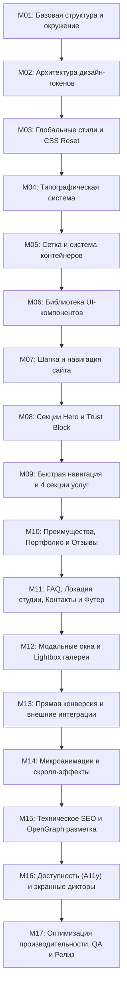

# Дорожная карта разработки — Ms. Adel (Beauty & Education)

> **Статус документа**: Утвержденная техническая спецификация и пошаговый план реализации.  
> **Стек**: Semantic HTML5, Vanilla CSS3 (Design Tokens, Bento Grid), Vanilla JavaScript (ES6+), Zero-Build Runtime.  
> **Дизайн-стиль**: Soft Premium (Мягкий премиальный минимализм).

---

## 📑 Оглавление

1. [Статус и аудит документации](#1-статус-и-аудит-документации)
2. [Результаты валидации требований](#2-результаты-валидации-требований)
3. [Инспекция текущего состояния проекта](#3-инспекция-текущего-состояния-проекта)
4. [Глобальные критерии приемки](#4-глобальные-критерии-приемки)
5. [Порядок разработки (17 независимых этапов)](#5-порядок-разработки-17-независимых-этапов)
   - [M01: Базовая структура и окружение](#m01-базовая-структура-и-окружение)
   - [M02: Архитектура дизайн-токенов](#m02-архитектура-дизайн-токенов)
   - [M03: Глобальные стили и CSS Reset](#m03-глобальные-стили-и-css-reset)
   - [M04: Типографическая система](#m04-типографическая-система)
   - [M05: Сетка и система контейнеров](#m05-сетка-и-система-контейнеров)
   - [M06: Библиотека UI-компонентов](#m06-библиотека-ui-компонентов)
   - [M07: Шапка и навигация сайта](#m07-шапка-и-навигация-сайта)
   - [M08: Секции Hero и Trust Block](#m08-секции-hero-и-trust-block)
   - [M09: Быстрая навигация и 4 секции услуг](#m09-быстрая-навигация-и-4-секции-услуг)
   - [M10: Преимущества, Портфолио и Отзывы](#m10-преимущества-портфолио-и-отзывы)
   - [M11: FAQ, Локация студии, Контакты и Футер](#m11-faq-локация-студии-контакты-и-футер)
   - [M12: Модальные окна и Lightbox галереи](#m12-модальные-окна-и-lightbox-галереи)
   - [M13: Прямая конверсия и внешние интеграции](#m13-прямая-конверсия-и-внешние-интеграции)
   - [M14: Микроанимации и скролл-эффекты](#m14-микроанимации-и-скролл-эффекты)
   - [M15: Техническое SEO и OpenGraph разметка](#m15-техническое-seo-и-opengraph-разметка)
   - [M16: Доступность (A11y) и экранные дикторы](#m16-доступность-a11y-и-экранные-дикторы)
   - [M17: Оптимизация производительности, QA и Релиз](#m17-оптимизация-производительности-qa-и-релиз)

---

# 1. Статус и аудит документации

Все проектные материалы проверены и являются единственным источником правды:

* **[docs/main_doc.md](file:///d:/projects/msadel3/docs/main_doc.md)** — Сводный мастер-документ (Бизнес, Рынок, ЦА, GAP-стратегия, Архитектура, Тексты, Дизайн-система).
* **[docs/01_business_info.md](file:///d:/projects/msadel3/docs/01_business_info.md)** — Бизнес-профиль мастера, студия The Glow Up, координаты, прайс-листы.
* **[docs/02_market_research.md](file:///d:/projects/msadel3/docs/02_market_research.md)** — Исследование 10 конкурентов Ташкента, позиционирование, CTA-модели.
* **[docs/03_target_audience_and_reviews.md](file:///d:/projects/msadel3/docs/03_target_audience_and_reviews.md)** — Страхи клиентов (боль, неестественность), отзывы 2ГИС, лексикон ЦА.
* **[docs/04_gap_and_conversion_strategy.md](file:///d:/projects/msadel3/docs/04_gap_and_conversion_strategy.md)** — Точки отстройки, 7 шагов воронки, 10 правил конверсии.
* **[docs/05_website_structure.md](file:///d:/projects/msadel3/docs/05_website_structure.md)** — Архитектура 12 секций лендинга персонального бренда.
* **[docs/06_website_copy.md](file:///d:/projects/msadel3/docs/06_website_copy.md)** — Утвержденный финальный текст для всех блоков.
* **[docs/07_design_system_and_guidelines.md](file:///d:/projects/msadel3/docs/07_design_system_and_guidelines.md)** и **[docs/DESIGN.md](file:///d:/projects/msadel3/docs/DESIGN.md)** — Спецификация Soft Premium (палитра, шрифты, отступы, запрещенные приемы).
* **[GEMINI.MD](file:///d:/projects/msadel3/GEMINI.MD)** — Инженерные правила, правило 5 состояний UI, стандарты качества Anti-AI Slop.

---

# 2. Результаты валидации требований

1. **Бизнес-информация подтверждает Стратегию**: 10+ лет опыта и 5000+ клиентов обосновывают отстройку через личный авторитет мастера и авторское обучение.
2. **Стратегия полностью отражена в структуре**: Воронка из 7 шагов разложена на 12 последовательных экранов с закрытием всех барьеров до перехода в мессенджер.
3. **Структура сайта поддержана копирайтингом**: Весь текст из `06_website_copy.md` сопоставлен 1:1 со структурой без пропущенных данных.
4. **Дизайн-код усиливает позиционирование**: Палитра Soft Premium (молочный `#F8F5F2`, пудровый `#F4DDE3`, бежевый `#EADCCF`, шоколадный `#5C4338`, розовый hover `#DFA8B7`) исключает холодность и визуальный шум.
5. **Противоречия и пробелы отсутствуют**: Все внешние ссылки (Telegram `@MisssAdel`, Instagram `@Lady_lash5`, Telegra.ph прайсы, карты Яндекс/Google) верифицированы.

---

# 3. Инспекция текущего состояния проекта

* **Технологический стек**: Чистый Vanilla Web (HTML5 / CSS3 / ES6+ JS). Без сборщиков (Webpack/Vite) — запуск напрямую в браузере.
* **Структура директорий**:
  * `/css/styles.css` — Монолитный CSS (требуется приведение к токенам Soft Premium).
  * `/js/script.js` — Интерактивность (меню, скролл-анимации, бегущая строка, модальное окно).
  * `/assets/images/` — Графические `.webp` ассеты (`main/`, `Отзывы/`, `Портфолио/`, `СписокПроцедур/`).
  * `/docs/` — Комплект канонической документации.
* **Несоответствия текущего кода и канонической документации для устранения в процессе разработки**:
  * Замена шрифтов `Cormorant Garamond` и `Inter` на `Plus Jakarta Sans` (заголовки) и `Manrope` (основной текст).
  * Обновление цветовых переменных под точную палитру Soft Premium.
  * Актуализация статистики (5000+ вместо 1000+) и ссылки на Instagram (`Lady_lash5`).
  * Реализация недостающих блоков структуры (Блок преимуществ «Почему мы», FAQ-аккордеон, согласование эскиза в перманенте).

---

# 4. Глобальные критерии приемки

Каждый этап разработки обязан удовлетворять следующим требованиям:
* **Автономная работоспособность**: Результат этапа компилируется/отображается без ошибок.
* **Mobile-First & Адаптивность**: Безупречный вид на экранах от 320px до 4K, отсутствие горизонтальной прокрутки (`overflow-x: clip`).
* **Доступность**: Touch-target элементов ≥ 44×44px, видимый `:focus-visible`, корректные ARIA-атрибуты, цветовой контраст по стандарту WCAG AA.
* **Чистый код**: Следование принципам DRY, KISS, правилу 5 состояний UI (Ideal, Empty, Loading, Error, Overflow).
* **Соответствие дизайн-системе**: Использование только токенов Soft Premium, запрет на неон, черный мрамор, золото и стоковую графику.

---

# 5. Порядок разработки (17 независимых этапов)

---

## M01: Базовая структура и окружение

### Цель
Подготовить чистый, валидный HTML5-каркас с корректными базовыми мета-тегами, настройками вьюпорта и предзагрузкой внешних шрифтовых ресурсов.

### Объем работ
1. Очистить и стандартизировать HTML5-документ в `index.html`.
2. Настроить кодировку `UTF-8`, язык `ru`, мета-тег `viewport` с `viewport-fit=cover`.
3. Добавить теги `preconnect` для `fonts.googleapis.com` и `fonts.gstatic.com`.
4. Подключить таблицы стилей и скрипты с атрибутом `defer`.

### Зависимости
Нет.

### Ожидаемый результат
Базовый HTML-документ открывается в браузере без ошибок синтаксиса и предупреждений консоли.

### Чек-лист проверки
- [ ] Тип документа — валидный HTML5 (`<!DOCTYPE html>`).
- [ ] Настроен корректный тег `viewport`.
- [ ] Ресурсы шрифтов предзагружаются через `preconnect`.
- [ ] В консоли разработчика 0 ошибок.

### Критерий готовности (Definition of Done)
HTML5-скелет страницы полностью валиден по стандартам W3C.

---

## M02: Архитектура дизайн-токенов

### Цель
Перенести все спецификации Soft Premium в системные CSS Custom Properties (`:root`).

### Объем работ
1. Объявить основные цветовые токены:
   - `--color-bg-primary: #F8F5F2` (Молочный фон)
   - `--color-bg-secondary: #F4DDE3` (Пудровый фон секций)
   - `--color-surface-card: #EADCCF` (Бежевая поверхность карточек)
   - `--color-text-primary: #5C4338` (Шоколадный текст и кнопки)
   - `--color-accent-hover: #DFA8B7` (Приглушенный розовый hover)
2. Объявить токены скруглений:
   - `--radius-sm: 4px`, `--radius-md: 8px`, `--radius-lg: 16px–20px` (кнопки), `--radius-xl: 24px–28px` (карточки), `--radius-full: 9999px`.
3. Объявить токены мягких шоколадных теней (`--shadow-soft: 0 10px 30px rgba(92, 67, 56, 0.05)`).
4. Задать шкалу вертикальных отступов (`--section-py-desktop: 120px`, `--section-py-mobile: 64px`).

### Зависимости
M01.

### Ожидаемый результат
Централизованный слой переменных в CSS, исключающий использование несистемных значений.

### Чек-лист проверки
- [ ] Все 5 базовых цветов Soft Premium заданы в `:root`.
- [ ] Заданы токены радиусов для кнопок (16–20px) и карточек (24–28px).
- [ ] Тень настроена с оттенком шоколадного цвета (альфа 0.05).
- [ ] Отсутствуют жестко закодированные произвольные HEX-коды.

### Критерий готовности
Все токены из `docs/07_design_system_and_guidelines.md` и `docs/DESIGN.md` объявлены и готовы к использованию.

---

## M03: Глобальные стили и CSS Reset

### Цель
Создать предсказуемую основу отображения элементов во всех браузерах без артефактов верстки.

### Объем работ
1. Задать сброс `box-sizing: border-box` для всех элементов и псевдоэлементов.
2. Настроить плавную прокрутку `scroll-behavior: smooth` с поддержкой `@media (prefers-reduced-motion: reduce)`.
3. Настроить безопасный рендеринг изображений (`display: block; max-width: 100%; height: auto;`).
4. Настроить предотвращение нежелательного горизонтального скролла (`overflow-x: clip`).
5. Установить базовый цвет фона body (`#F8F5F2`) и цвет текста (`#5C4338`).

### Зависимости
M02.

### Ожидаемый результат
Чистый холст страницы, единообразный во всех браузерах, без скачков и нежелательных полос прокрутки.

### Чек-лист проверки
- [ ] Сброс отступов и box-sizing работает корректно.
- [ ] Горизонтальный скролл полностью заблокирован.
- [ ] Изображения не выходят за пределы родительских контейнеров.
- [ ] Цвет фона страницы строго соответствует токену `--color-bg-primary`.

### Критерий готовности
Глобальные стили применены, фон и базовые элементы отображаются корректно.

---

## M04: Типографическая система

### Цель
Подключить шрифты **Plus Jakarta Sans** и **Manrope**, выстроить строгую и выразительную типографическую иерархию.

### Объем работ
1. Подключить Google Fonts: `Plus Jakarta Sans` (500, 600, 700) и `Manrope` (400, 500, 600).
2. Задать переменные `--font-heading` и `--font-body`.
3. Настроить стили заголовков:
   - Отрицательный трекинг (`letter-spacing: -0.02em`).
   - Плотный интерлиньяж (`line-height: 1.1–1.2`).
   - Балансировка строк (`text-wrap: balance`).
   - Масштаб H1: 48–72px (десктоп) / 40px (мобильные).
4. Настроить стили основного текста:
   - Размер: 18–20px, интерлиньяж: 1.6, балансировка `text-wrap: pretty`.
5. Добавить утилиту `.tabular-nums` для фиксации ширины цифр в ценах и датах.

### Зависимости
M03.

### Ожидаемый результат
Премиальная читаемая типографика с идеальным контрастом и адаптивным масштабированием заголовков.

### Чек-лист проверки
- [ ] Заголовки отображаются в Plus Jakarta Sans.
- [ ] Текст абзацев отображается в Manrope с высотой строки 1.6.
- [ ] Заголовки на мобильных не ломают верстку и читаются комфортно.
- [ ] Цены и числовые показатели отображаются с выравниванием цифр (tabular numbers).

### Критерий готовности
Типографика страницы полностью соответствует гайдлайнам `07_design_system_and_guidelines.md`.

---

## M05: Сетка и система контейнеров

### Цель
Создать адаптивную контейнерную систему и гибкие bento-сетки с большим количеством «воздуха».

### Объем работ
1. Создать базовый класс `.container` с `max-width: 1200px–1280px` и паддингами `16px / 24px / 32px`.
2. Реализовать отступы между секциями (`100px–140px` десктоп / `64px` мобильные).
3. Создать 12-колоночную сетку для десктопа с гэпом `24px`.
4. Настроить адаптивную перестройку: 2 колонки на планшетах, 1 колонка на мобильных.
5. Обеспечить внутренние отступы в карточках не менее `32px` для сохранения эстетики скруглений.

### Зависимости
M04.

### Ожидаемый результат
Универсальный каркас разметки, обеспечивающий пространственный ритм и симметрию на любых разрешениях.

### Чек-лист проверки
- [ ] Контейнер центрируется и держит безопасные боковые поля.
- [ ] Секции имеют достаточный воздух (вертикальные поля 100–140px).
- [ ] Сетки плавно адаптируются под экраны планшетов и смартфонов.
- [ ] Текст внутри карточек не прилипает к скругленным углам.

### Критерий готовности
Компоненты раскладки протестированы на контрольных точках 320px, 768px, 1024px, 1440px.

---

## M06: Библиотека UI-компонентов

### Цель
Создать переиспользуемые, доступные базовые компоненты интерфейса Soft Premium.

### Объем работ
1. **Главная кнопка** (`.btn-primary`):
   - Заливка `#5C4338`, текст `#F8F5F2`, высота `56–60px`, скругление `16–20px`.
   - Hover-состояние: переход в `#DFA8B7`, активное нажатие `scale(0.98)`.
2. **Второстепенная кнопка** (`.btn-secondary`, `.btn-outline`):
   - Фон `#EADCCF` или тонкая граница 1px без золота и неоновых эффектов.
3. **Карточки** (`.card-surface`):
   - Фон `#EADCCF` или `#FFFFFF`, скругление `24–28px`, тень `0 10px 30px rgba(92, 67, 56, 0.05)`.
4. **Бейджи и оверлайны** (`.badge`, `.eyebrow`):
   - Верхний регистр, межбуквенный интервал `0.05em`, размер `14–16px`.
5. Обеспечить поддержку правила 5 состояний UI (Default, Hover/Focus, Active, Disabled, Loading).

### Зависимости
M05.

### Ожидаемый результат
Изолированная библиотека UI-компонентов, готовая к интеграции в секции сайта.

### Чек-лист проверки
- [ ] Кнопки соответствуют высоте 56–60px и скруглению 16–20px.
- [ ] Минимальная область касания на тач-экранах ≥ 44×44px.
- [ ] Реализованы плавные переходы цветов без рывков.
- [ ] Состояния фокуса четко различимы (`:focus-visible`).

### Критерий готовности
Все UI-компоненты автономно отрендерены и проверены во всех интерактивных состояниях.

---

## M07: Шапка и навигация сайта

### Цель
Разработать фиксированную шапку с логотипом, якорным меню, кнопкой быстрой записи и адаптивным мобильным меню.

### Объем работ
1. Сверстать десктопную шапку: логотип «Ms. Adel», навигация по секциям, кнопка «Записаться».
2. Добавить обработчик скролла: появление фона и размытия (`.is-scrolled`).
3. Сверстать мобильное меню-бургер с переключателем и выдвижной/полноэкранной панелью.
4. Обеспечить закрытие меню по клику на ссылку, оверлей или клавишу `Escape`.
5. Добавить управление атрибутами доступности `aria-expanded` и `aria-hidden`.

### Зависимости
M06.

### Ожидаемый результат
Навигация обеспечивает мгновенный доступ к любому разделу сайта с мобильных и десктопных устройств.

### Чек-лист проверки
- [ ] Шапка зафиксирована в верхней части экрана с корректным `z-index`.
- [ ] Бургер-кнопка переключает состояние меню и обновляет ARIA-атрибуты.
- [ ] Выбор пункта меню плавно скроллит страницу к якорю и закрывает мобильную панель.
- [ ] Блокировка прокрутки body при открытом мобильном меню.

### Критерий готовности
Шапка и мобильное меню полностью протестированы на десктопе и мобильных тач-устройствах.

---

## M08: Секции Hero и Trust Block

### Цель
Сверстать первый экран (Hero) и блок доверия к мастеру («О мастере») в строгом соответствии с копирайтингом и конверсионной стратегией.

### Объем работ
1. **Секция Hero (`#hero`)**:
   - Надзаголовок: `Luxury beauty master`.
   - Заголовок H1: `Красота начинается с мастера, которому доверяют`.
   - Подзаголовок с полным позиционированием (ресницы, перманент, лазер, обучение, 10+ лет, 5000+ клиентов).
   - Основной CTA: «Записаться в Telegram» (`https://t.me/MisssAdel`).
   - Быстрые переходы к процедурам и обучению.
   - Главное фото мастера с явным `aspect-ratio` для устранения CLS.
2. **Секция Trust Block («О мастере», `#about`)**:
   - Заголовок: `Здравствуйте, меня зовут Адель`.
   - Текст о философии естественной красоты и авторском подходе.
   - Bento-блок ключевых фактов: `10+ лет опыта`, `5000+ счастливых клиентов`, `4 направления сертификации`, `Студия The Glow Up (Сергели)`.

### Зависимости
M07.

### Ожидаемый результат
Первый экран формирует премиальное первое впечатление, сразу закрывая вопрос позиционирования и опыта мастера.

### Чек-лист проверки
- [ ] Текст H1 и подзаголовка полностью соответствует `06_website_copy.md`.
- [ ] Число довольных клиентов указано корректно (`5000+`).
- [ ] Кнопка записи ведет на `t.me/MisssAdel` с `target="_blank" rel="noopener noreferrer"`.
- [ ] Фотография мастера не вызывает сдвигов макета при загрузке (CLS = 0).

### Критерий готовности
Hero и Trust Block сверстаны, адаптивны и проверены на экранах от 320px до 1920px.

---

## M09: Быстрая навигация и 4 секции услуг

### Цель
Реализовать блок быстрой навигации и 4 детализированные секции услуг: Ресницы, Перманентный макияж, Лазерная эпиляция и Обучение.

### Объем работ
1. **Быстрая навигация**: 4 карточки быстрого перехода к направлениям.
2. **Секция «Ресницы» (`#eyelashes`)**:
   - Описание наращивания, ламинирования, корейской техники и ботокса.
   - Список выгод, открытая цена `от 100 000 сум`, ссылка на полный прайс в Telegra.ph и CTA записи.
3. **Секция «Перманентный макияж» (`#permanent`)**:
   - Пудровое напыление, теневая растушевка, акварельные губы, эффект помады.
   - **4 этапа процедуры** с обязательным акцентом на **согласование эскиза ДО начала работы**.
   - Открытая цена `от 400 000 сум`, ссылка на прайс и CTA записи.
4. **Секция «Лазерная эпиляция» (`#laser`)**:
   - Зоны (лицо, подмышки, руки, ноги, бикини), акцент на безболезненность и безопасность.
   - Открытая цена `от 100 000 сум`, ссылка на прайс и CTA записи.
5. **Секция «Обучение мастеров» (`#training`)**:
   - 3 программы: Ламинирование, Наращивание, Комбо-курс.
   - Акцент: `100% предоставление материалов и моделей для практики`.
   - CTA записи на обучение.

### Зависимости
M08.

### Ожидаемый результат
Все 4 коммерческих направления детально презентованы с полной прозрачностью цен и снятием страхов клиентов.

### Чек-лист проверки
- [ ] Все названия процедур, этапы и цены соответствуют `06_website_copy.md`.
- [ ] В блоке перманента наглядно выделен этап согласования эскиза.
- [ ] В блоке обучения указано предоставление моделей и материалов.
- [ ] Ссылки на Telegra.ph открываются в новой вкладке.

### Критерий готовности
Все секции услуг работают, имеют собственные CTA и адаптированы под мобильные устройства.

---

## M10: Преимущества, Портфолио и Отзывы

### Цель
Сверстать блок отстройки («Почему Ms. Adel»), галерею реальных работ и блок контекстных отзывов клиентов.

### Объем работ
1. **Секция преимуществ («Почему выбирают нас»)**:
   - Карточки отстройки: честный прогноз без ложных обещаний, строгая стерильность, фиксация эскиза, 10+ лет опыта.
2. **Секция «Портфолио» (`#portfolio`)**:
   - Галерея реальных макро-снимков по направлениям (Ресницы, Перманент, Лазер).
   - Интерактивный горизонтальный скролл / drag-scroll с поддержкой перетаскивания мышью и свайпа.
3. **Секция «Отзывы» (`#reviews`)**:
   - Реальные отзывы клиентов из 2ГИС с именами и указанием процедуры.
   - Бегущая строка (marquee) с возможностью остановки при взаимодействии.

### Зависимости
M09.

### Ожидаемый результат
Мощный блок социального доказательства, подтверждающий высокое качество работы реальными кейсами и отзывами.

### Чек-лист проверки
- [ ] Фотографии работ четкие, без артефактов и «пластиковой» ретуши.
- [ ] Слайдер/бегущая строка работает плавно, без дерганий и зависаний.
- [ ] Отзывы содержат конкретику по процедурам и имена клиентов.
- [ ] Перетаскивание (drag-scroll) работает как на тач-экранах, так и на мыши.

### Критерий готовности
Блоки преимуществ, портфолио и отзывов полностью функциональны и интегрированы в лендинг.

---

## M11: FAQ, Локация студии, Контакты и Футер

### Цель
Сверстать аккордеон частых вопросов, блок студии с картами, контактный блок и футер.

### Объем работ
1. **Секция FAQ (`#faq`)**:
   - Аккордеон с ответами на ключевые вопросы (болезненность, выбор процедуры, прозрачность цен).
   - Плавное раскрытие с поддержкой клавиатуры.
2. **Секция «Локация студии» (`#location`)**:
   - Салон красоты `The Glow Up`, адрес: `Сергели-8, дом 21С`, ориентир: `Ресторан Jiz-Biz`.
   - График: `Ежедневно с 10:00 до 20:00`.
   - Кнопки перехода на Яндекс.Карты (`https://yandex.uz/maps/-/CPsCeGjS`) и Google Maps (`https://maps.app.goo.gl/VDGRirLiJ4STCRtZ6`).
   - Фотографии пространства студии.
3. **Секция «Контакты» (`#contacts`)**:
   - Кнопки прямой связи: Telegram (`@MisssAdel`), Instagram (`@Lady_lash5`), Телефон (`+998 90 924 44 16`).
4. **Футер сайта (`footer`)**:
   - Копирайт © 2026, брендинг Ms. Adel, бейдж разработчика.

### Зависимости
M10.

### Ожидаемый результат
Все 12 секций структуры лендинга полностью собраны в единый логический сценарий.

### Чек-лист проверки
- [ ] FAQ открывается и закрывается без сбоев верстки.
- [ ] Ссылки на Яндекс.Карты и Google Maps ведут на точные координаты студии.
- [ ] Ссылка на Instagram ведет на `@Lady_lash5`.
- [ ] Клик по телефону инициирует вызов `tel:+998909244416`.

### Критерий готовности
Все 12 секций сайта сверстаны, наполнены утвержденным контентом и связаны навигацией.

---

## M12: Модальные окна и Lightbox галереи

### Цель
Реализовать доступное модальное окно (Lightbox) для полноразмерного просмотра фоторабот портфолио.

### Объем работ
1. Сверстать модальный оверлей Lightbox с полупрозрачным размытым фоном.
2. Реализовать открытие полноразмерного фото по клику на карточку портфолио с выводом названия работы.
3. Добавить кнопку закрытия (`×`), закрытие по клику на фон и по нажатию клавиши `Escape`.
4. Реализовать блокировку скролла страницы при открытом окне без горизонтального сдвига макета.
5. Реализовать захват фокуса (Focus Trap) внутри модального окна и возврат фокуса на элемент вызова.

### Зависимости
M11.

### Ожидаемый результат
Пользователи могут детально рассматривать примеры работ без потери позиции прокрутки страницы.

### Чек-лист проверки
- [ ] Клик по любой фотографии портфолио открывает модальное окно с правильной картинкой.
- [ ] Окно закрывается по кнопке, клику вне фото и по клавише `Escape`.
- [ ] Фокус клавиатуры удерживается внутри открытого окна.
- [ ] Прокрутка страницы блокируется при открытом Lightbox.

### Критерий готовности
Модуль Lightbox работает стабильно, без утечек памяти и с полной доступностью для клавиатуры.

---

## M13: Прямая конверсия и внешние интеграции

### Цель
Проверить и протестировать все целевые действия (CTA) и внешние ссылки проекта.

### Объем работ
1. Проверить все кнопки записи в Telegram (`https://t.me/MisssAdel`) во всех блоках сайта.
2. Проверить ссылки на полные прайс-листы в Telegra.ph (Ресницы, Перманент, Лазер).
3. Проверить ссылки на Instagram (`@Lady_lash5`), Telegram-канал (`@MissAdelBeauty`), телефон и интерактивные карты.
4. Добавить атрибуты безопасности `target="_blank" rel="noopener noreferrer"` на все внешние ссылки.

### Зависимости
M12.

### Ожидаемый результат
Все точки взаимодействия на сайте ведут на рабочие, актуальные внешние ресурсы без битых ссылок (404).

### Чек-лист проверки
- [ ] Каждая кнопка «Записаться» открывает диалог с `@MisssAdel`.
- [ ] Все 3 ссылки на Telegra.ph открывают актуальные прайсы.
- [ ] На всех внешних ссылках прописан `rel="noopener noreferrer"`.
- [ ] Номер телефона корректно отформатирован для мобильного набора.

### Критерий готовности
100% ссылок сайта проверены и успешно открывают целевые страницы.

---

## M14: Микроанимации и скролл-эффекты

### Цель
Внедрить плавные, производительные скролл-анимации появления блоков и тактильные микроинтеракции.

### Объем работ
1. Реализовать появление элементов по скроллу через легковесный `IntersectionObserver` (класс `.reveal` → `.is-visible`).
2. Добавить каскадные задержки (`transition-delay`) для элементов сеток и списков преимуществ.
3. Добавить микроанимации кнопок (легкий подъем `translateY(-1px)`, тактильный клик `scale(0.98)`).
4. Настроить строгое отключение анимаций при включенном режиме пониженного движения (`prefers-reduced-motion: reduce`).
5. Исключить тяжелые фоновые 3D-эффекты и навязчивые анимации, запрещенные правилами Soft Premium.

### Зависимости
M13.

### Ожидаемый результат
Интерфейс выглядит живым, отзывчивым и премиальным, работая с частотой 60fps на любых устройствах.

### Чек-лист проверки
- [ ] Анимации выполняются на GPU-свойствах (`transform`, `opacity`).
- [ ] При быстром скролле отсутствуют подергивания и задержки кадров.
- [ ] При `prefers-reduced-motion: reduce` все анимации мгновенно отключаются.
- [ ] Отсутствуют запрещенные эффекты (неон, золотые блестки, тяжелый параллакс).

### Критерий готовности
Микроанимации работают плавно, подчеркивая спокойную эстетику Soft Premium.

---

## M15: Техническое SEO и OpenGraph разметка

### Цель
Настроить базовую поисковую оптимизацию, социальные мета-теги и семантическую микроразметку.

### Объем работ
1. Проверить строгую иерархию заголовков: строго один `<h1>` на странице, логичные `<h2>` и `<h3>`.
2. Задать оптимизированный тег `<title>`: `Ms. Adel — Архитектура взгляда | Бьюти-услуги и обучение в Ташкенте`.
3. Заполнить мета-тег `<meta name="description">` с перечислением ключевых направлений.
4. Настроить OpenGraph и Twitter Card теги (`og:title`, `og:description`, `og:image`, `og:url`, `og:type="website"`, `og:locale="ru_RU"`).
5. Внедрить микроразметку Schema.org в формате JSON-LD для локального бизнеса (`BeautySalon`) и курсов (`Course`).

### Зависимости
M14.

### Ожидаемый результат
Сайт формирует красивые сниппеты при шеринге в мессенджерах/соцсетях и готов к индексации поисковыми системами.

### Чек-лист проверки
- [ ] На странице присутствует ровно один тег `<h1>`.
- [ ] Изображение `OpenGraph.webp` корректно подгружается в предпросмотре соцсетей.
- [ ] JSON-LD валидируется без ошибок в Schema Markup Validator.
- [ ] Семантические теги HTML5 (`<main>`, `<header>`, `<section>`, `<article>`, `<footer>`) использованы по назначению.

### Критерий готовности
SEO-теги и структурированные данные полностью внедрены и валидны.

---

## M16: Доступность (A11y) и экранные дикторы

### Цель
Обеспечить полное соответствие стандартам доступности интерфейса WCAG 2.1 AA.

### Объем работ
1. Проверить контрастность текста: шоколадный `#5C4338` на фонах `#F8F5F2` и `#EADCCF` (не менее 4.5:1).
2. Добавить понятные `alt`-описания всем содержательным изображениям; декоративные элементы пометить `aria-hidden="true"`.
3. Обеспечить полную навигацию по странице только с клавиатуры (`Tab`, `Shift+Tab`, `Enter`, `Space`, `Escape`).
4. Настроить видимые индикаторы фокуса для всех интерактивных элементов.
5. Проверить чтение интерактивных состояний экранными дикторами.

### Зависимости
M15.

### Ожидаемый результат
Сайт доступен для людей с ограниченными возможностями здоровья и корректно управляется с клавиатуры.

### Чек-лист проверки
- [ ] Вся страница полностью проходима с клавиатуры без использования мыши.
- [ ] Контрастность текста удовлетворяет критериям WCAG AA.
- [ ] Индикаторы фокуса четко видны на всех интерактивных элементах.
- [ ] Отсутствуют ошибки доступности в аудитах Lighthouse/Axe.

### Критерий готовности
Интерфейс проходит аудит доступности без критических замечаний.

---

## M17: Оптимизация производительности, QA и Релиз

### Цель
Провести комплексное тестирование, оптимизацию скорости загрузки (Core Web Vitals) и финальную приемку перед релизом.

### Объем работ
1. Оптимизировать загрузку графики: атрибуты `width`, `height`, `loading="lazy"` для нижних блоков, `fetchpriority="high"` для первого экрана.
2. Провести кроссбраузерное тестирование (Chrome, Safari, Edge, Firefox, мобильные iOS/Android).
3. Провести регрессионный чеклист по файлу `GEMINI.MD`.
4. Проверить отсутствие ошибок и мусорных логов в консоли браузера.
5. Проверить стабильность макета (CLS = 0) и быструю отрисовку первого контента (LCP < 1.2s).

### Зависимости
M01 – M16.

### Ожидаемый результат
Готовый к публичному запуску, сверхбыстрый, адаптивный лендинг премиум-уровня.

### Чек-лист проверки
- [ ] Оценка производительности Lighthouse ≥ 95+.
- [ ] Показатели Core Web Vitals: LCP < 1.2s, CLS = 0, FID/INP < 100ms.
- [ ] Верстка проверена на реальных мобильных устройствах.
- [ ] Выполнены все пункты `Pre-Release Self-Check Checklist` из `GEMINI.MD`.

### Критерий готовности
Проект полностью готов к деплою в продакшн.
